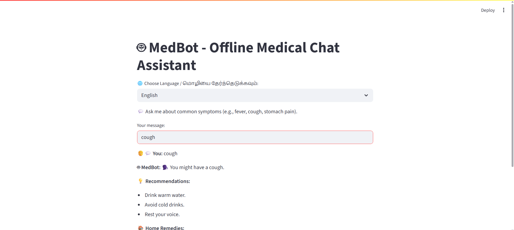
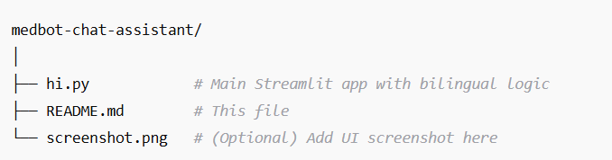

# 🤖 MedBot - Offline Medical Chat Assistant

A lightweight, offline medical chatbot built using **Streamlit**.  
Ask common health-related questions and get instant responses based on predefined medical rules. No internet required, runs locally!
Now with **bilingual support** – Tamil 🇮🇳 and English 🌍!

---

## 🩺 Features

- Handles common symptoms like **fever, cough, stomach pain, headache,** etc.
- Provides basic medical advice with a friendly UI.
- Stores chat history during the session.
- Fully offline and private.
- Built using **Python** and **Streamlit**.

---

## 🚀 Demo

![MedBot Screenshot]

---

## 🔧 Setup Instructions

1. **Clone the repository**:
   
   git clone https://github.com/your-username/medbot-chat-assistant.git
   cd medbot-chat-assistant
2.Install dependencies:

pip install streamlit

3.Run the app:

streamlit run hi.py
Open browser and go to: http://localhost:8501

🧪 Example Inputs
You can ask:

I have a fever

I'm feeling dizzy

mapla stomach pain irruku

இருமல் இருக்குது

வயிற்று வலி இருக்கு

MedBot will respond in your selected language with suggestions and home remedies.

📁 File Structure

🛡️ Disclaimer
MedBot is for educational and informational purposes only. It is not a substitute for professional medical advice. Please consult a doctor for any serious health issues.

